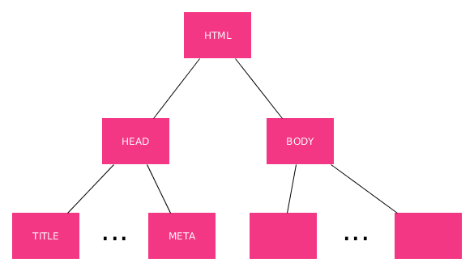

## Parte II - 3 Estructura de una página Web

**¡¡¡Vamos al lío!!!**

Una vez ya tenemos claro qué es eso de _etiqueta_ con lo que yo voy a llenar mi página web el siguiente paso es tener muy claro qué estructura tiene que tener mi web.

**NOTA:** Recordad que HTML define la estructura que tiene que tener una web.

De manera general podemos representar toda página Web como un árbol _genealógico_ cuya estructura común, para todas las webs, podemos decir que será la siguiente:



Esto significa lo siguiente:

- Hay una etiqueta _padre_ de todo, la etiqueta **html** y entre la apertura y el cierre de esta etiqueta meteremos el resto de nuestra página.
- La etiqueta **html** tiene dos hijos, la etiqueta **head** que es la cabecera, que ya veremos que elementos contiene, y la etiqueta **body** que es la que en realidad contiene los elementos de mi web.
- A su vez esas dos etiquetas anteriores puede tener sus propios hijos y así sucesivamente.

Un ejemplo de esto sería:

```html
<!DOCTYPE html>
<html lang="es">
<head>
    <!--Esto no se ve -->
    <meta charset="UTF-8">
    <meta name="viewport" content="width=device-width, initial-scale=1.0">
    <meta http-equiv="X-UA-Compatible" content="ie=edge">
    <title>Mi primera página</title>
</head>
<body>
    <!-- Esto tampoco se ve -->
    <h1>HOLA MUNDO</h1>
</body>
</html>
```
